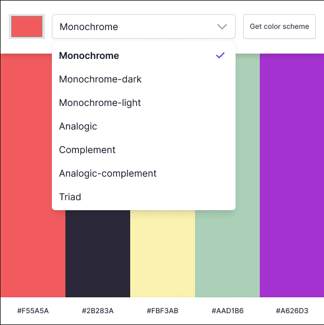

# Color Scheme Generator

## Project Details

- Choose a "seed color" with an HTML color picker.
- Choose color scheme mode with a dropdown.
- Get color scheme button makes a request to a Color API.
- API being used http://www.thecolorapi.com
- Display the scheme colors and hex values on the page.
- Double Click to copy the HEX code.

---

> JavaScript, HTML, CSS

---

### Selectable Color Theme Modes

- Monochrome
- Monochrome-Dark
- Monochrome-Light
- Analogic
- Complement
- Analogic-Complement
- Triad
